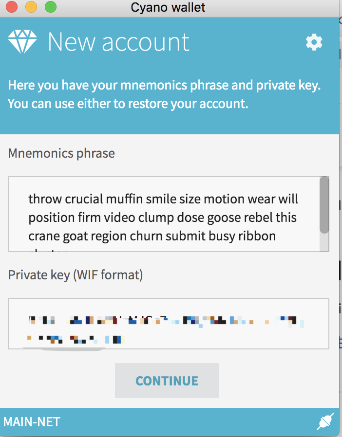
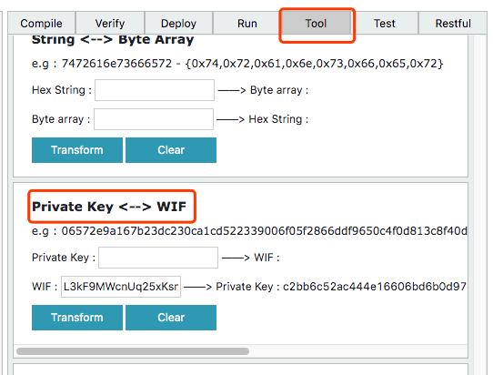
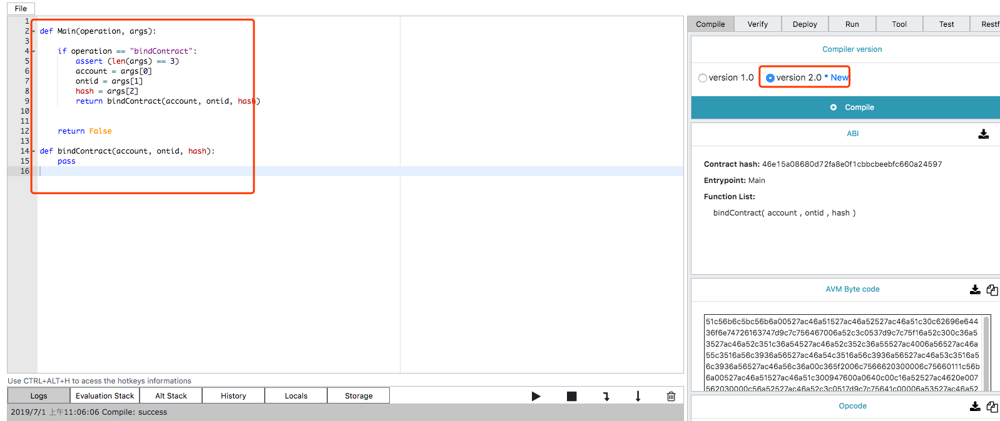
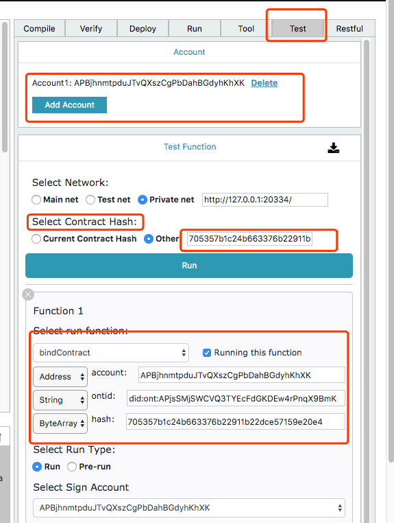

## Invoke smart contract  via Smartx


### Motivation

This document demonstrates how to invoke any deployed smart contract via **smartx**


### 1. Create ontology wallet by Cyano

Please make sure you have install **cyano wallet ** in chrome web store

After install cyano,  create a new account


### 2. Save WIF format private key



### 3. WIF transform to private key

In python project, click **"Tool"**button, transfer **WIF** to **private key**




### 4. compile smart contract ABI template

copy below smart contract source code to SmartX Python project

```python

def Main(operation, args):

    if operation == "bindContract":
        assert (len(args) == 3)
        account = args[0]
        ontid = args[1]
        hash = args[2]
        return bindContract(account, ontid, hash)


    return False

def bindContract(account, ontid, hash):
    pass

```




### 5. Invoke smart contract 

In python project, click **"Test"**button, invoke smart contract.


#### 5.1 Add ontology wallet account

Enter the private key obtained in step **3**

#### 5.2 select MainNet

choose the network based on the environment in which the contract is deployed.

in current example, select MainNet

#### 5.3 select contract hash

please select **Other** selection

####5.4 add invoke function

Add the function that needs to be invoked

In  current example, please select **bindContract**

#### 5.5 Select Sigle Account

just select obtained account in step **5.1**

#### 5.6 Input invoked function parameters

in current example, parameters are

- `Account`

  it is a **Address** type 

- `ontid`

  **string** type

- `hash`

  smart contract hash, **byte array** type

#### 5.7 Click "Run" invoke smart contract


